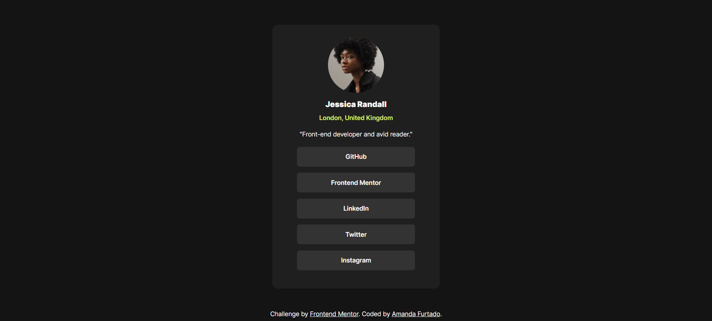
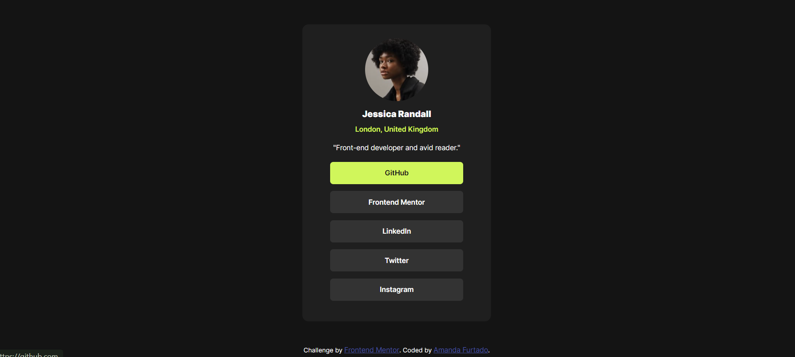

# Frontend Mentor - Social Links Profile 🖥️

Essa é uma solução para o desafio [Social links Profile do Frontend Mentor](https://www.frontendmentor.io/challenges/social-links-profile-UG32l9m6dQ)

## O desafio 🧩
O desafio propõe a criação de um perfil com links para redes sociais, sendo a página final o mais parecido com o design proposto quanto possível.  
Os usuários devem conseguir visualizar os estados hover e foco para todos os elementos interativos da página.
Os designs apresentados são os seguintes:
- Design padrão:

- Design ativo:


## Print do resultado 📸
- Padrão:

- Ativo:


### Feito com 🔧
- HTML5
- CSS
- Flexbox

### O que aprendi e dificuldades enfrentadas 📖
Sempre gostei muito de desenvolver páginas estáticas com HTML e CSS, é uma prática que pretendo continuar aprimorando.  
Fiquei muito feliz com o resultado obtido!  
Um aprendizado tido com o projeto foi inserir a tag `<li>` dentro da tag `<a>`, para que ao clicar em qualquer lugar do botão seja direcionado ao endereço indicado.
```html
<a href="https://github.com" target="_blank">
    <li>GitHub</li>
</a>
```
Minha maior dificuldade com projetos semelhantes é o alinhamento vertical, sendo um ponto a ser melhorado. Com o código atual, o design funciona bem para o desktop, mas existem falhas quando alterado para dispositivos móveis.

### Desenvolvimento contínuo 🔜
Para o contínuo desenvolvimento e aprimoramento do projeto, tenho como objetivo principal a correção do alinhamento vertical do cartão.  
Alternativamente, quero transformar em um projeto pessoal com as minhas informações e links para as minhas redes sociais, além de inserir um botão de estilo diferente dos demais que direciona o usuário direto para o e-mail.

### Autora 👩🏻
Se quiser entrar em contato comigo para alguma dúvida ou sugestão:
- [Linkedin](https://www.linkedin.com/in/furtado-amanda/)
